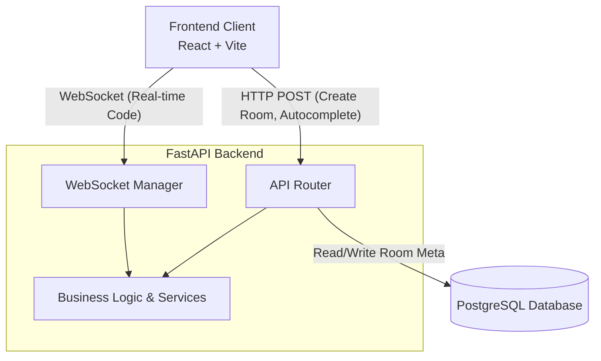
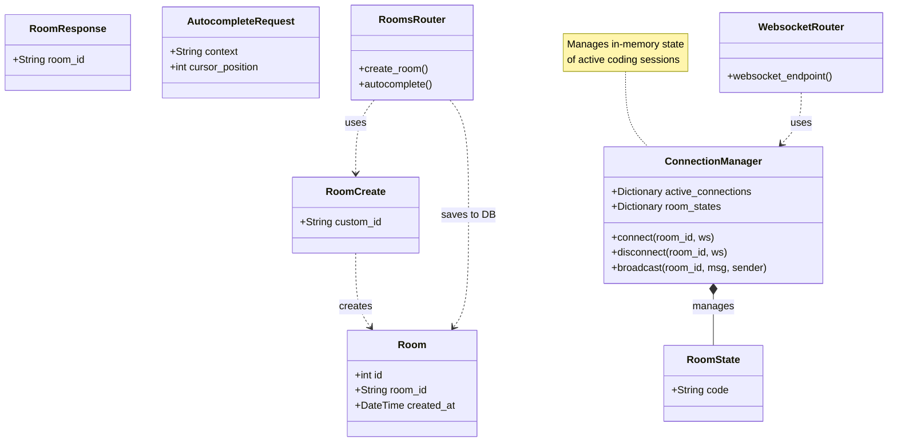
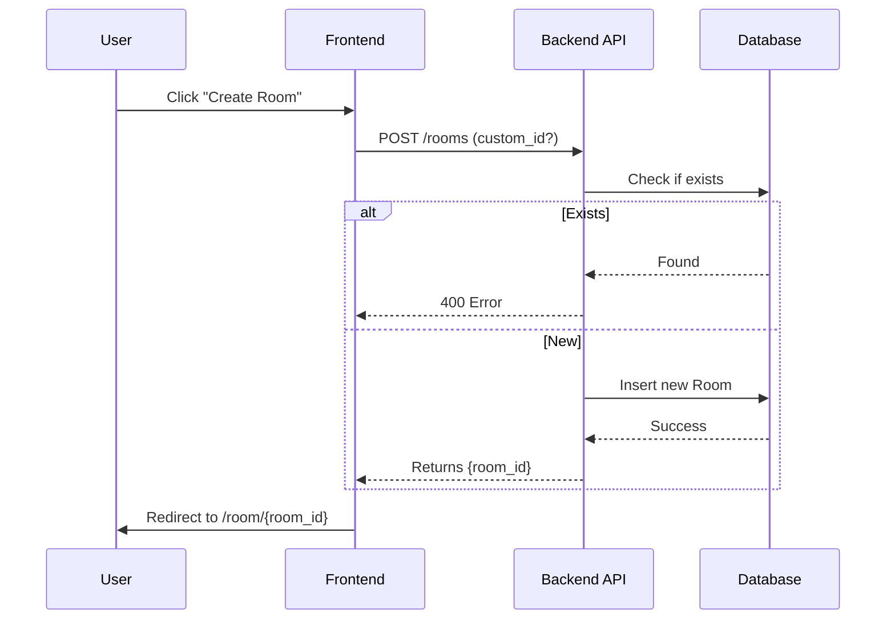
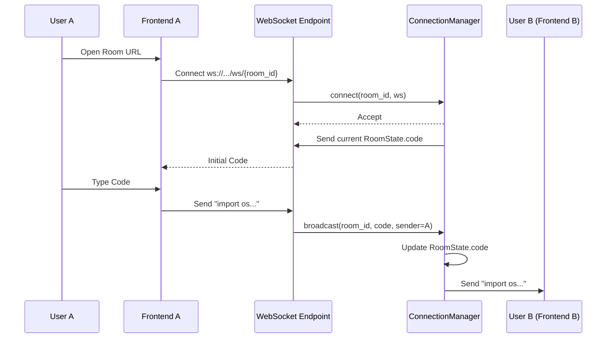
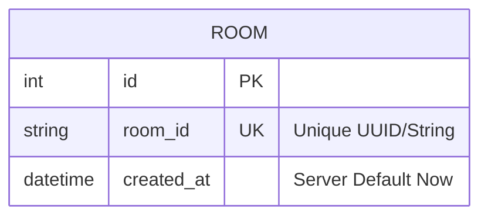

# Project Structure and Architecture

This document visualizes the structure and behavior of the **Collaborative Code Editor** application.

## 1. High-Level Architecture
The application consists of a React/Vite frontend and a FastAPI backend, communicating via REST APIs and WebSockets.

## 2. Backend Class and Component Diagram
This diagram details the relationships between the models, schemas, routers, and services in the backend.

## 3. Sequence Diagrams

### 3.1 Room Creation Flow
User creates a room via the frontend.

### 3.2 WebSocket Connection & Collaboration
User joins a room and starts typing.

## 4. Entity Relationship Diagram (ERD)
The database schema for persistent data.

