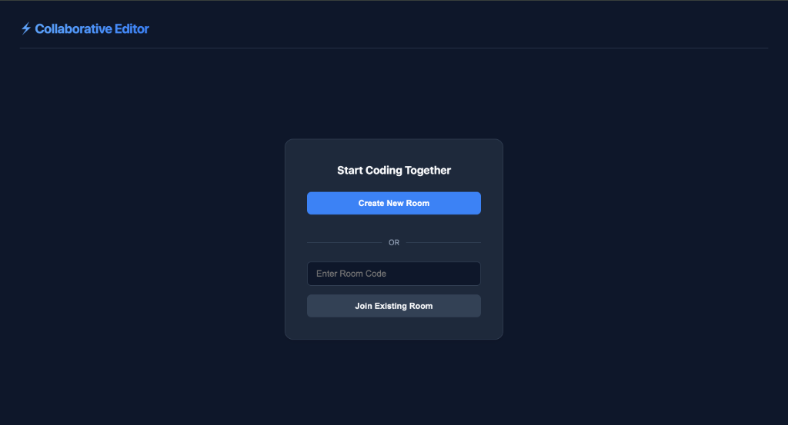
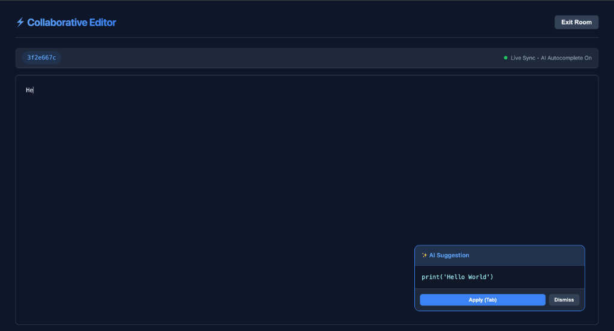
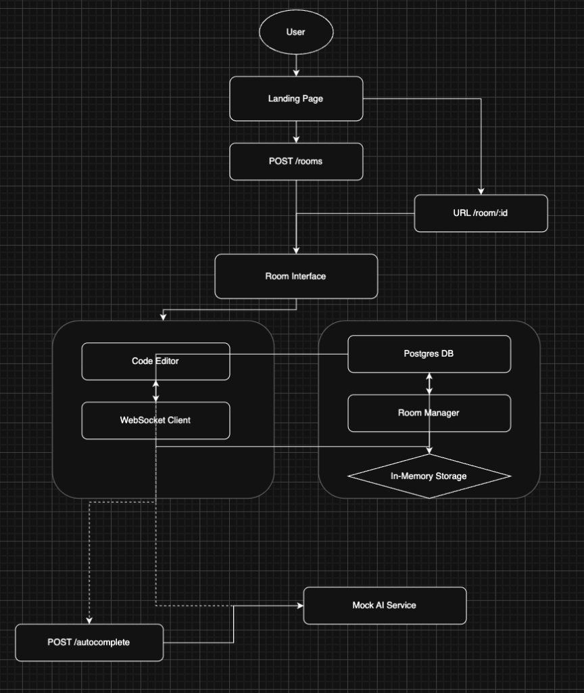

# Collaborative Code Editor

A real-time collaborative code editor built with Python (FastAPI) and React, designed to meet the requirements of a modern pair-programming tool.

## Features
- **Real-Time Synchronization**: Seamless code editing between multiple users using WebSockets.
- **Room Management**: Create unique rooms or join existing ones via URL (e.g., `/room/xyz`).
- **AI Autocomplete**: Auto-triggered mock AI suggestions after 600ms of inactivity.
- **Persistent Metadata**: Room creation events are logged in PostgreSQL.
- **Premium UI**: Dark-themed, responsive interface with a focus on developer experience.

## AI Capabilities (Mocked)

As per the key requirement, the AI autocomplete is a simulated service. It currently provides the following static suggestions randomly to demonstrate the "trigger-display-apply" workflow:

1. `print('Hello World')`
2. `def mock_function(): pass`
3. `import os` + `import sys`
4. `return True`

To test this, simply stop typing in the editor for **600ms**, and one of these suggestions will appear.

## Screenshots


*Landing page with Room Creation and Joining*


*Real-time Editor with AI Autocomplete*

## Architecture & Design Choices

### Backend (FastAPI)
- **Framework**: FastAPI was chosen for its high performance (Asynchronous IO) and native WebSocket support.
- **Protocol**: WebSockets (`/ws/{roomId}`) handle the real-time bidirectional communication required for the editor.
- **State Management**: 
  - **In-Memory**: Active room code state is held in memory (`RoomManager`) for millisecond-latency access.
  - **Database**: PostgreSQL is used to store room metadata (`Room` model).
- **Routing**: Clean separation of concerns with dedicated routers for `rooms` (REST) and `websocket` (Real-time).

### Frontend (React + Vite)

*High-level architecture showing User interaction, Frontend-Backend WebSocket sync, and AI Service integration.*
- **State**: React's local state manages the editor content, while `useEffect` hooks handle WebSocket events (`onmessage`, `onopen`).
- **Debouncing**: The AI autocomplete API call is debounced by 600ms.
  - **CSS**: Custom vanilla CSS variables (dark mode) are used for a lightweight, performant design system.

### API Documentation (Swagger UI)
The backend provides interactive API documentation generated by Swagger UI.
- **URL**: [http://localhost:8000/docs](http://localhost:8000/docs)
- **Features**: Test endpoints (`POST /rooms`, `POST /autocomplete`) directly from the browser.

## Setup & Running

### Option 1: Docker Compose (Recommended)
This requires Docker and Docker Compose to be installed.

```bash
# Build and Run the entire stack (Frontend + Backend + DB)
docker-compose up --build
```
The application will be available at:
- **Frontend**: [http://localhost:5173](http://localhost:5173)
- **Backend**: [http://localhost:8000](http://localhost:8000)

### Option 2: Manual Local Setup

### Prerequisites
- Python 3.9+
- Node.js (v18+)
- PostgreSQL

### 1. Database Setup (PostgreSQL)
You can install PostgreSQL via Homebrew or run it using Docker.

```bash
docker run --name collab-db -e POSTGRES_USER=user -e POSTGRES_PASSWORD=password -e POSTGRES_DB=collab_db -p 5432:5432 -d postgres
```

### 2. Backend Setup
```bash
cd backend
python3 -m venv venv
source venv/bin/activate

# Install dependencies
pip install fastapi uvicorn websockets sqlalchemy asyncpg pydantic greenlet

# Run the server
uvicorn main:app --reload --port 8000
```

### 3. Frontend Setup
```bash
cd frontend
npm install

# Run the development server
npm run dev
```
Open [http://localhost:5173](http://localhost:5173) in your browser.

## Improvements & Enhancements (Evaluation Criteria)

While this prototype meets the core requirements, several enhancements would make it production-ready:

### 1. Dockerization (Compose)
**Status**: ✅ **Implemented**
We have dockerized the whole application by creating a `docker-compose.yml` file. This orchestrates the `backend`, `frontend` (served via Nginx), and `postgres` containers together, allowing the entire stack to be spun up with a single `docker-compose up` command.

### 2. Robust Persistence (Redis)
**Current Limitation**: Code state is stored in Python memory. If the server restarts, code is lost.
**Improvement**: Use **Redis** to store the active state of each room. This allows the backend to be stateless and scalable.

### 3. OT/CRDTs for Concurrency
**Current Limitation**: Last-Write-Wins.
**Improvement**: Implement **Yjs** or **Automerge** for conflict-free concurrent editing.

### 4. Authentication
**Improvement**: Add JWT-based authentication to secure room access.
