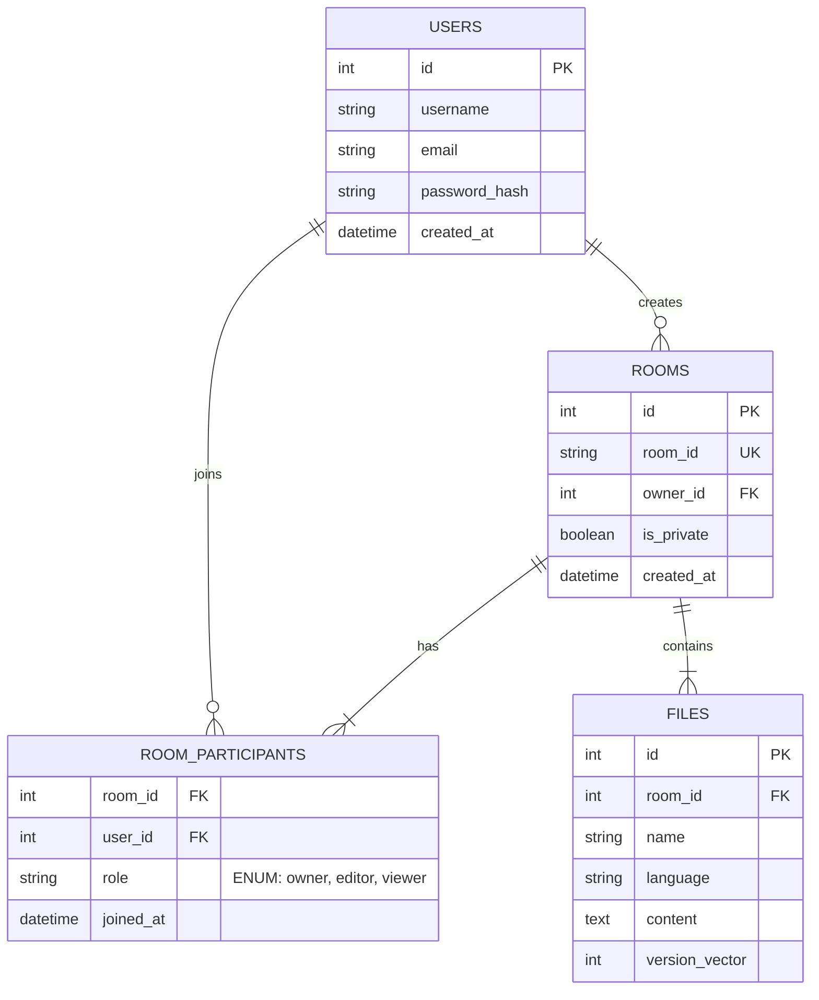
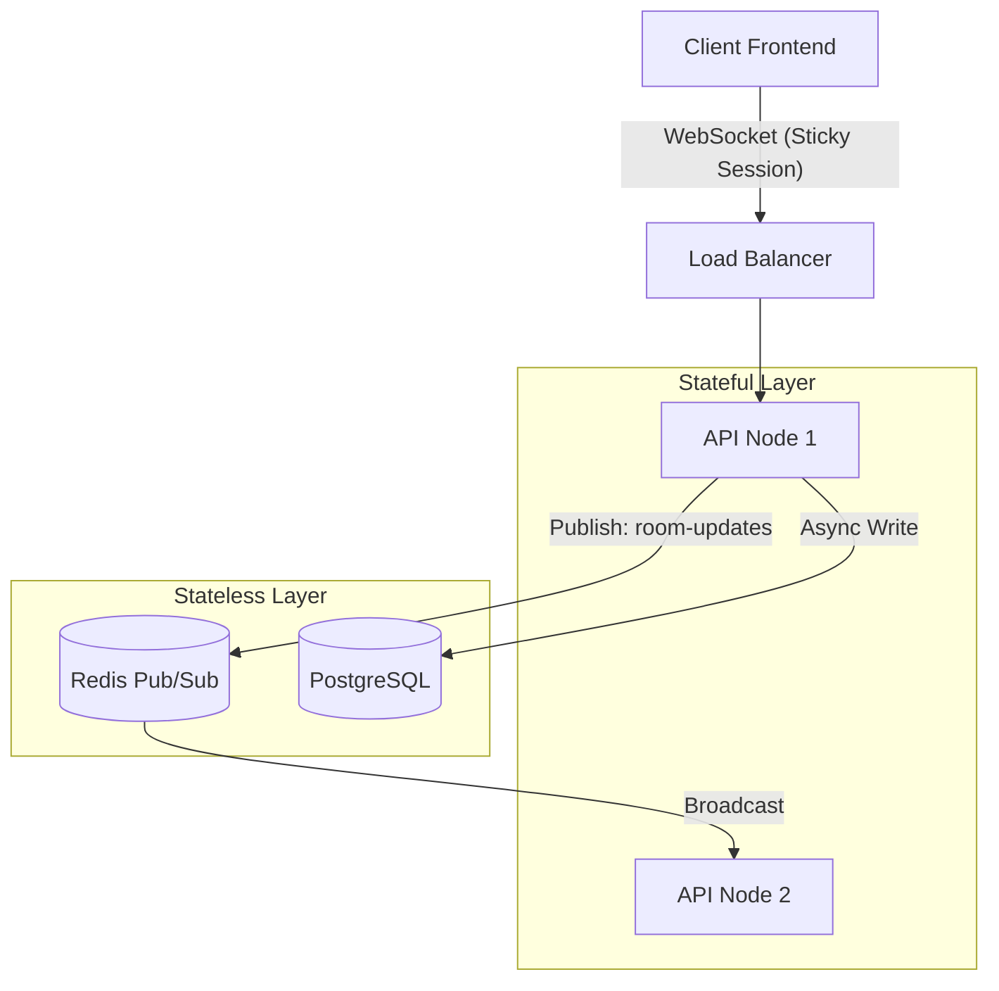
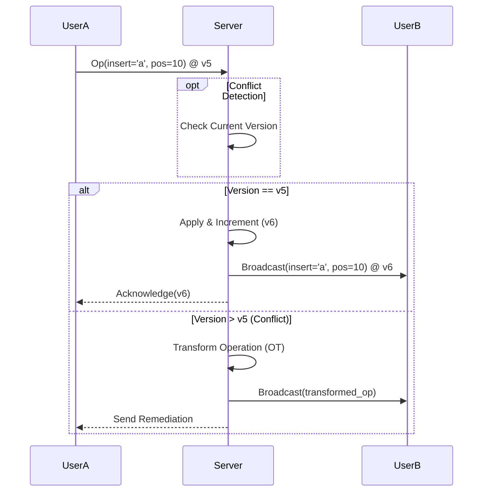

# System Architecture & Technical Roadmap

This document outlines the architectural vision for evolving the Collaborative Code Editor into a production-grade platform.

## 1. Database Schema Design
The database handles metadata, authentication, and persistence of code state. It allows for complex relationship management between users, rooms, and files.

### Technical Rationale
*   **Normalized Relationship Model**: The use of a junction table (`ROOM_PARTICIPANTS`) decouples Users from Rooms, enabling a flexible Many-to-Many relationship. This supports scenarios where a single user contributes to multiple coding sessions simultaneously.
*   **Role-Based Access Control (RBAC)**: Storing explicit `roles` within the participation link allows the API layer to enforce granular permissions (e.g., Viewers can subscribe to WebSockets but cannot emit 'edit' events).

---

## 2. Distributed Real-Time Architecture
To support thousands of concurrent sessions, the system decouples connection state from application logic using a Pub/Sub model.

### Architectural Decisions
*   **WebSocket Protocol**: Provides the necessary full-duplex communication channel for low-latency (<50ms) updates, far superior to HTTP polling for this use case.
*   **Horizontal Scalability**: WebSocket connections are stateful. By introducing Redis Pub/Sub, we essentially make the nodes "stateless" regarding data distribution—any node can broadcast an update to any other node.
*   **Ephemeral vs. Persistent State**: High-frequency data (cursor movements, active selections) is routed exclusively through Redis to reduce database I/O pressure. Only document content is flushed to PostgreSQL.

---

## 3. Collaborative Consistency Model
Handling concurrent edits requires robust conflict resolution strategies to ensure all users see the same document state.

### Concurrency Strategy
*   **Operational Transformation (OT)**: Standard mechanism used by Google Docs/Etherpad. It mathematically transforms operations based on concurrent changes, ensuring eventual consistency without discarding user input.
*   **Causality Tracking**: By versioning every operation vector, the server acts as the central source of truth, ordering events linearly to resolve race conditions.
