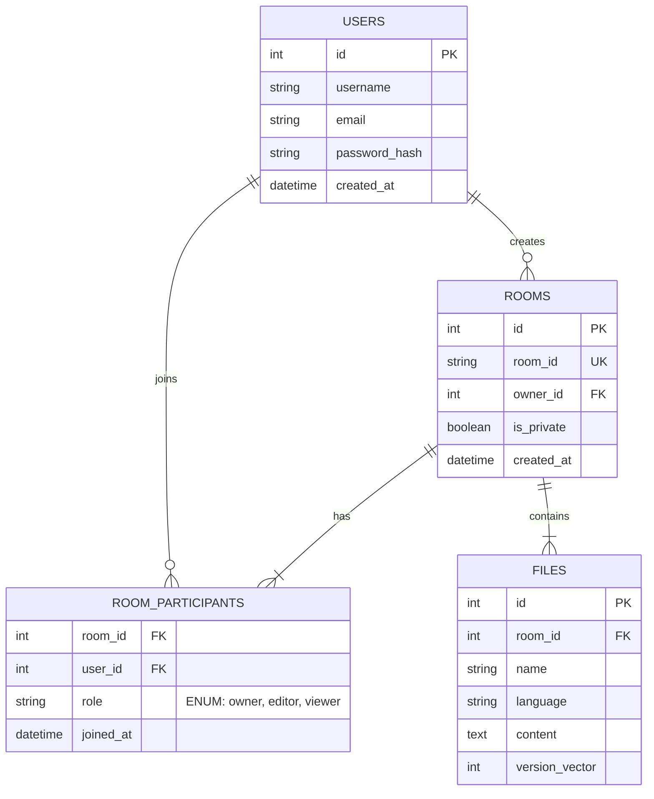

# System Architecture & Technical Roadmap

This document outlines the architectural vision for evolving the Collaborative Code Editor into a production-grade platform.

## 1. Database Schema Design
The database handles metadata, authentication, and persistence of code state. It allows for complex relationship management between users, rooms, and files.

### Technical Rationale
*   **Normalized Relationship Model**: The use of a junction table (`ROOM_PARTICIPANTS`) decouples Users from Rooms, enabling a flexible Many-to-Many relationship. This supports scenarios where a single user contributes to multiple coding sessions simultaneously.
*   **Role-Based Access Control (RBAC)**: Storing explicit `roles` within the participation link allows the API layer to enforce granular permissions (e.g., Viewers can subscribe to WebSockets but cannot emit 'edit' events).
